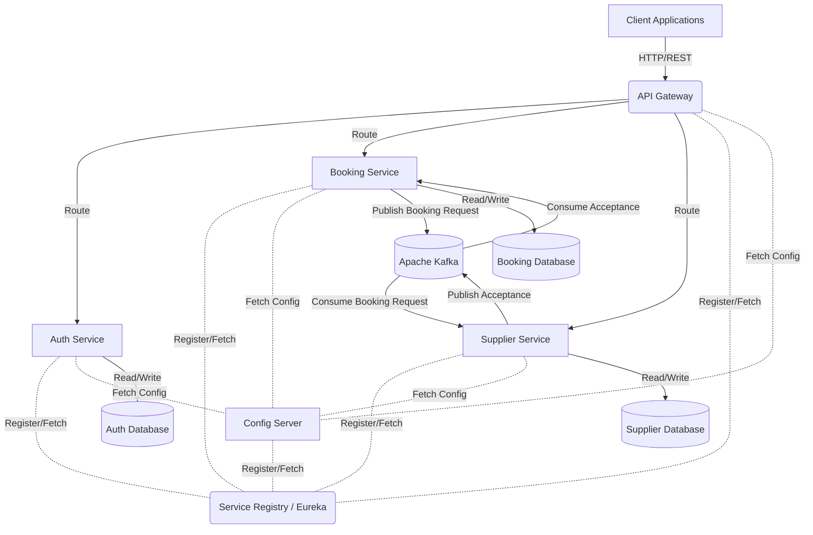
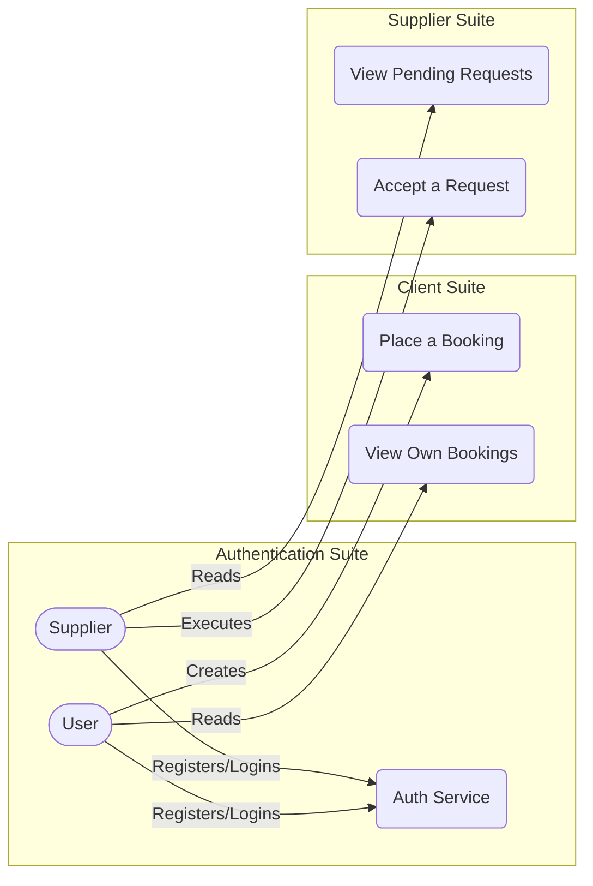
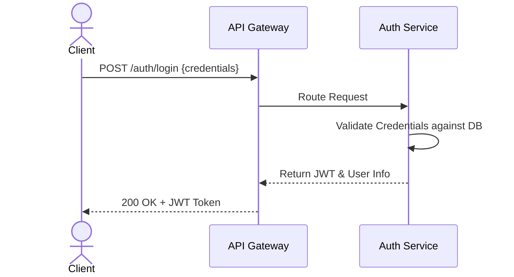
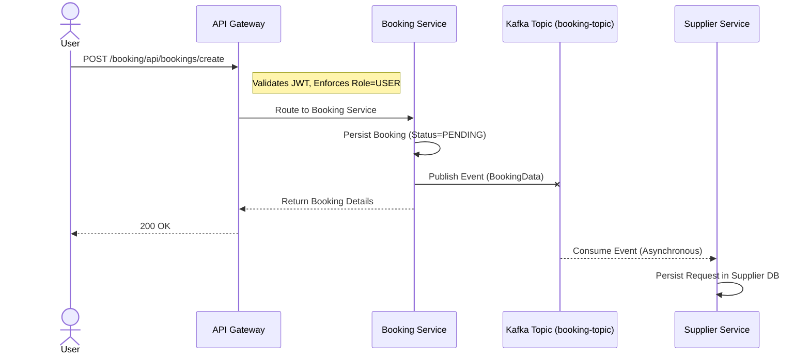
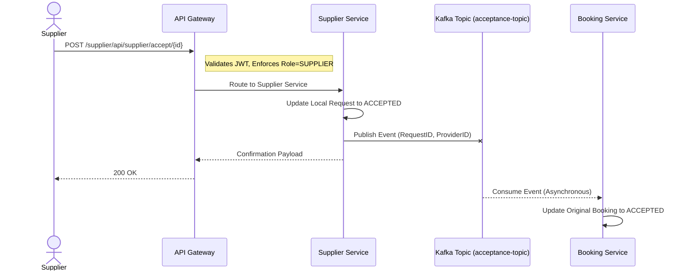

<div align="center">

# Event-Driven Service Marketplace

**A production-grade microservices platform for service booking and supplier management, built with event-driven architecture using Spring Boot, Spring Cloud, and Apache Kafka.**

[](https://spring.io/projects/spring-boot)
[](https://spring.io/projects/spring-cloud)
[](https://kafka.apache.org/)
[](https://openjdk.org/)
[](https://www.docker.com/)
[](https://spring.io/projects/spring-security)
[](https://cloud.spring.io/spring-cloud-netflix/)
[](https://maven.apache.org/)
[](https://www.h2database.com/)

---

</div>

## Table of Contents

- [Overview](#overview)
- [Architecture](#architecture)
- [Services](#services)
- [Centralized Configuration](#centralized-configuration)
- [Event-Driven Communication](#event-driven-communication)
- [API Reference](#api-reference)
- [Getting Started](#getting-started)
- [Service Port Map](#service-port-map)

---

## Overview

This platform implements a fully distributed microservices architecture designed around service booking and supplier fulfillment. The system follows domain-driven design principles, separating concerns across independently deployable services that communicate through both synchronous REST calls (via a centralized API Gateway) and asynchronous event streaming (via Apache Kafka).

Key architectural decisions include:

- **Stateless authentication** through JSON Web Tokens, enforced at the gateway level before requests reach downstream services.
- **Service discovery** through Netflix Eureka, eliminating hardcoded service locations and enabling horizontal scaling.
- **Externalized configuration** through Spring Cloud Config Server, pulling versioned property files from a dedicated Git repository.
- **Asynchronous decoupling** between the Booking and Supplier domains using Kafka topics, ensuring that neither service holds a direct dependency on the other.

---

## Architecture

### High-Level System Topology



### Actor Use Cases



### Authentication Flow



### Booking Event Flow



### Supplier Acceptance Flow



---

## Services

### Service Registry (Eureka)

The service registry acts as the backbone of the microservices mesh. Every service in the platform registers itself with Eureka on startup and periodically sends heartbeat signals. Other services query the registry to resolve instance locations at runtime, enabling client-side load balancing and eliminating the need for hardcoded host/port configurations.

### Config Server

The Config Server provides externalized, environment-aware configuration management for every service in the platform. It connects to a remote Git repository to serve versioned property files, ensuring that changes to configuration can be tracked, rolled back, and promoted across environments without redeploying any service.

### API Gateway

The API Gateway is the sole entry point for all external client traffic. It performs two critical functions: **routing** incoming requests to the correct internal microservice based on path predicates, and **security enforcement** by intercepting every request through a global `JwtAuthFilter` to validate the bearer token before forwarding traffic downstream. Unauthorized or malformed requests are rejected at this layer, shielding backend services from unauthenticated access.

### Auth Service

The Auth Service is responsible for identity management across the platform. It handles user registration (supporting `USER` and `SUPPLIER` roles), credential validation, and JWT issuance. All tokens are signed with HMAC-SHA and carry role claims, which the API Gateway inspects on every subsequent request to enforce role-based access control.

### Booking Service

The Booking Service encapsulates the core booking domain. When a user places a booking, the service persists it with a `PENDING` status and publishes an event to the `booking-topic` Kafka topic. It also acts as a consumer on the `acceptance-topic`, listening for supplier acceptance events to update the booking status to `ACCEPTED` and record the assigned supplier.

### Supplier Service

The Supplier Service manages the supplier-facing workflow. It consumes booking events from Kafka, maintains a local view of pending requests, and exposes endpoints for suppliers to view and accept those requests. Upon acceptance, it publishes an event to the `acceptance-topic`, completing the asynchronous handshake with the Booking Service.

---

## Centralized Configuration

All application property files for every microservice in this platform are stored and version-controlled in a dedicated external repository:

**[service-marketplace-centralized-config](https://github.com/Aniketh78/service-marketplace-centralized-config)**

The Spring Cloud Config Server in this project connects to that repository at startup and serves the appropriate configuration to each microservice based on the application name specified in their `bootstrap.yml` or `application.yml`. This separation ensures that:

- Configuration changes do not require code changes or redeployment of services.
- Environment-specific properties (dev, staging, production) can be managed through Git branching or profile-based naming conventions.
- Sensitive values can be managed independently from the application source code.

---

## Event-Driven Communication

The platform uses Apache Kafka as its asynchronous messaging backbone, enabling loose coupling between the Booking and Supplier bounded contexts. The event flow follows a well-defined lifecycle:

| Step | Actor | Action | Kafka Topic |
|------|-------|--------|-------------|
| 1 | User | Places a booking through the API Gateway | -- |
| 2 | Booking Service | Persists booking as `PENDING`, publishes event | `booking-topic` |
| 3 | Supplier Service | Consumes the event, stores the pending request locally | `booking-topic` |
| 4 | Supplier | Views pending requests and accepts one | -- |
| 5 | Supplier Service | Updates local status, publishes acceptance event | `acceptance-topic` |
| 6 | Booking Service | Consumes the acceptance, updates booking to `ACCEPTED` | `acceptance-topic` |

This choreography-based saga pattern ensures that neither the Booking nor Supplier service holds a synchronous dependency on the other, improving fault tolerance and enabling independent scaling.

---

## API Reference

### Authentication

| Method | Endpoint | Description | Access |
|--------|----------|-------------|--------|
| `POST` | `/auth/register` | Register a new user with role `ROLE_USER` or `ROLE_SUPPLIER` | Public |
| `POST` | `/auth/login` | Authenticate credentials and receive a signed JWT | Public |

### Bookings

| Method | Endpoint | Description | Access |
|--------|----------|-------------|--------|
| `POST` | `/booking/api/bookings/create` | Create a new booking request | `ROLE_USER` |
| `GET` | `/booking/api/bookings/my-bookings` | Retrieve all bookings for the authenticated user | `ROLE_USER` |

### Supplier Operations

| Method | Endpoint | Description | Access |
|--------|----------|-------------|--------|
| `GET` | `/supplier/api/supplier/see-requests` | List all pending booking requests | `ROLE_SUPPLIER` |
| `POST` | `/supplier/api/supplier/accept/{id}` | Accept a specific pending request | `ROLE_SUPPLIER` |

> All endpoints except authentication routes require a valid JWT in the `Authorization` header prefixed with `Bearer`.

---

## Getting Started

### Prerequisites

- **JDK 21** or higher
- **Apache Maven** 3.8+
- **Docker** and **Docker Compose**

### Build and Deploy

**1. Clone the repository**

```bash
git clone https://github.com/Aniketh78/event-driven-service-marketplace.git
cd event-driven-service-marketplace
```

**2. Build Docker images for each service using Google Jib**

Run the following command inside each service directory (`APIGateway`, `AuthService`, `bookingService`, `SupplierService`, `config-server`, `service_registry`):

```bash
mvn clean compile jib:dockerBuild
```

**3. Start the infrastructure**

```bash
cd docker
docker-compose up -d
```

The Docker Compose configuration enforces a strict startup order using health checks:

1. **Zookeeper** starts first and exposes port `19092`.
2. **Kafka** waits for a healthy Zookeeper before starting on port `9092`.
3. **Service Registry** starts independently on port `8761`.
4. **Config Server** waits for the Service Registry, then starts on port `8888`.
5. **API Gateway**, **Auth Service**, **Booking Service**, and **Supplier Service** wait for both the Config Server and Service Registry to be available before starting.

**4. Verify**

Once all containers are running, navigate to `http://localhost:8761` to confirm that all services have registered with Eureka. All client-facing traffic should be routed through the API Gateway at `http://localhost:8082`.

---

## Service Port Map

| Service | Port | Description |
|---------|------|-------------|
| Service Registry (Eureka) | `8761` | Service discovery and registration dashboard |
| Config Server | `8888` | Centralized configuration provider |
| API Gateway | `8082` | Single entry point for all client requests |
| Auth Service | `8081` | Authentication and JWT issuance |
| Booking Service | `8083` | Booking creation and lifecycle management |
| Supplier Service | `8084` | Supplier request viewing and acceptance |
| Apache Kafka | `9092` | Message broker for async communication |
| Zookeeper | `19092` | Kafka cluster coordination |

---

<div align="center">


</div>
