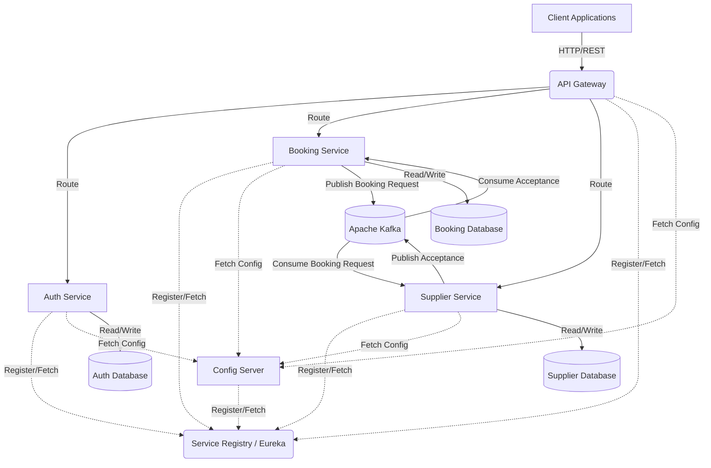
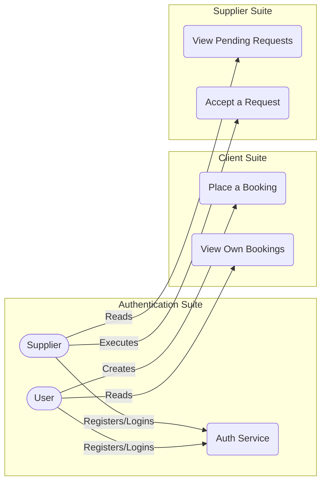
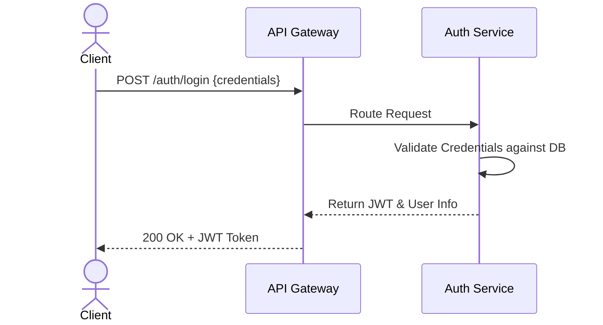
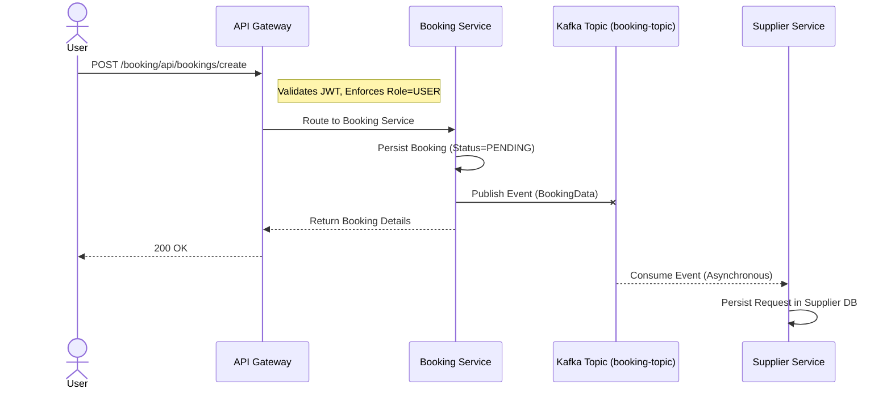
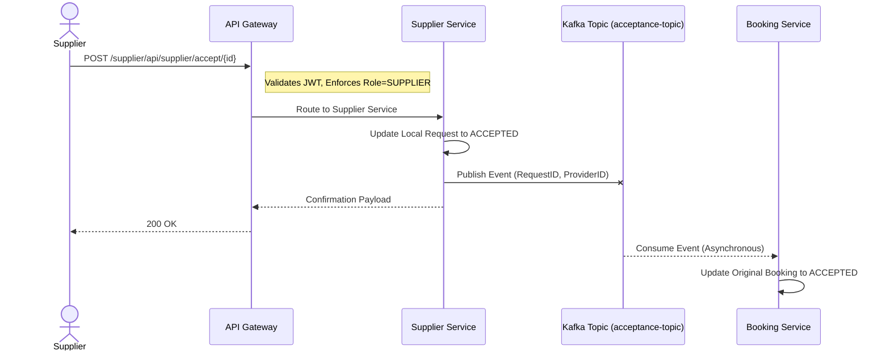

# Booking Microservices Architecture

## Overview

The Booking Microservices Architecture is a comprehensive, distributed system built on Spring Boot and Spring Cloud. It handles user authentication, service discovery, centralized configuration, booking management, and supplier-side request handling. Communication between services occurs synchronously via REST/API Gateway routing and asynchronously via Apache Kafka.

## Features

- **User Authentication & Authorization**: Secure, stateless access using JSON Web Tokens (JWT). Role-based access control enforces business rules for `USER` and `SUPPLIER` roles.
- **Service Discovery**: Integration with Netflix Eureka allows dynamic scaling, service registration, and intelligent routing.
- **Centralized Configuration**: Spring Cloud Config is leveraged to manage and version-control application properties across all microservices centrally.
- **API Gateway Pattern**: Spring Cloud Gateway provides a single entry point for clients, handling dynamic routing, global CORS configuration, and security pre-filtering.
- **Event-Driven Communication**: Services remain highly decoupled by utilizing Apache Kafka to broadcast state changes asynchronously.

## Architecture & Diagrams

### High-Level Architecture Diagram

### Actor Use Cases

### Sequence Diagram: Authentication Flow

### Sequence Diagram: Booking Event Flow

### Sequence Diagram: Supplier Acceptance Flow

## System Components

### 1. Service Registry (Eureka)
- **Description**: Centralized registry for all microservices in the cluster to register themselves and discover others.
- **Port**: 8761
- **Role**: Provides client-side load balancing and resilient routing metadata without hardcoding IPs and ports.

### 2. Config Server
- **Description**: Spring Cloud Config server that centralizes the property files for all the microservices.
- **Role**: Offers version-controlled configuration management. Services can pull their environment-specific application configuration dynamically upon startup.

### 3. API Gateway
- **Description**: The single entry point to the system for all clients. 
- **Port**: 8082
- **Role**: 
  - Routes traffic to appropriate internal services (Auth, Booking, Supplier).
  - Performs global security tasks, such as intercepting requests to validate JSON Web Tokens (JWT) using a global `JwtAuthFilter`.
  - Blocks unauthorized requests before they hit backend services.

### 4. Auth Service
- **Description**: Responsible for identity management and securing the platform.
- **Role**: 
  - Allows registration of different roles (e.g., USER, SUPPLIER).
  - Authenticates credentials and issues signed JWTs upon successful log-in.
  - Secures endpoints and enforces role limitations.

### 5. Booking Service
- **Description**: The core business capability where clients (USERs) can manage bookings.
- **Role**: 
  - Receives booking requests. Creates an initial record internally as `PENDING`.
  - Acts as a Kafka producer, publishing a message containing booking details into a Kafka topic (`booking-topic`).
  - Acts as a Kafka consumer, listening for updates from suppliers to mark a booking as `ACCEPTED`.

### 6. Supplier Service
- **Description**: Handles the supplier side of the business domain. Restricted only to users with the SUPPLIER role.
- **Role**: 
  - Consumes messages from the Kafka topic emitted by the Booking Service.
  - Maintains a local database view of available, pending requests.
  - Exposes an endpoint (`/see-requests`) to view available requests.
  - Exposes an endpoint (`/accept/{id}`) allowing a supplier to accept a specific booking.
  - Upon acceptance, emits an acceptance event via Kafka, which is then processed by the Booking Service to complete the workflow.

## Technology Stack

- **Framework**: Spring Boot 3.x, Spring Cloud
- **Language**: Java 17+
- **Message Broker**: Apache Kafka
- **Database**: H2 (In-Memory) / Spring Data JPA
- **Security**: Spring Security, JJWT (io.jsonwebtoken)
- **Containerization**: Docker (Optional)

## API Reference (Summary)

### Authentication
- `POST /auth/register` - Register a new user (`ROLE_USER` or `ROLE_SUPPLIER`).
- `POST /auth/login` - Authenticate and retrieve a JWT token.

### Bookings (USER only)
- `POST /booking/api/bookings/create` - Create a new booking.
- `GET /booking/api/bookings/my-bookings` - Retrieve all bookings associated with the authenticated user.

### Suppliers (SUPPLIER only)
- `GET /supplier/api/supplier/see-requests` - View all pending booking requests published to the network.
- `POST /supplier/api/supplier/accept/{id}` - Accept a generated request.

## Asynchronous Communication Flow

1. **Placing a Booking**: A user accesses the Booking Service through the API Gateway, initiating a new booking. The Booking service stores this as `PENDING` and publishes an asynchronous event to an Apache Kafka topic.
2. **Supplier Notification**: The Supplier Service consumes the Kafka event and records the pending request in its own data store.
3. **Accepting a Request**: A supplier queries their service to find `PENDING` requests. When they accept a request, the Supplier Service updates its internal status and publishes an accepted event to Kafka holding both the booking ID and supplier ID.
4. **Finalizing the Booking**: The Booking Service receives the acceptance event from Kafka and updates the original booking record, permanently binding it to the assigned supplier and marking the status as `ACCEPTED`.

## Getting Started

### Prerequisites
- JDK 17 or higher
- Apache Maven
- Apache Kafka & Zookeeper (local or containerized)
- A preferred RDBMS or in-memory DB instances (e.g., PostgreSQL, H2)

### Starting the Infrastructure
1. Start Kafka and Zookeeper local clusters.
2. Start the `Service Registry` application first.
3. Start the `Config Server` second.
4. Allow a few moments for these base infrastructure services to initialize fully.

### Starting the Microservices
1. Run the `API Gateway`.
2. Run the `Auth Service`.
3. Run the `Booking Service`.
4. Run the `Supplier Service`.

Once all services exhibit a running state and have successfully registered themselves with Eureka on port 8761, the platform is ready for traffic. All client interactions should securely pass via the API Gateway over port 8082, authenticated by tokens generated by the Auth Service.
