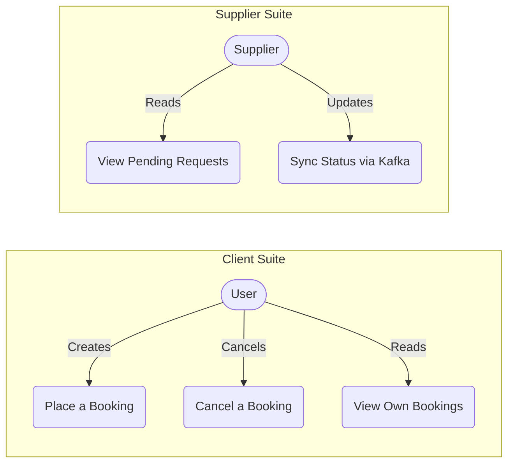

# Event-Driven Service Marketplace

**A production-grade microservices platform for service booking and supplier management, built with event-driven architecture using Spring Boot, Spring Cloud, and Apache Kafka.**

---

## Overview

This platform implements a fully distributed microservices architecture designed around service booking and supplier fulfillment.

## Features

- **Service Booking**: Users can create service requests.
- **Booking Cancellation**: Users can cancel existing bookings, which triggers an update to the supplier via Kafka.
- **Supplier Fulfillment**: Suppliers receive and process booking requests in real-time.

## Architecture

### Actor Use Cases

## API Reference

### Booking Service
| Endpoint | Method | Description |
| :--- | :--- | :--- |
| `/api/bookings/create` | `POST` | Create a new booking request |
| `/api/bookings/my-bookings` | `GET` | Retrieve logged-in user's bookings |
| `/api/bookings/cancel/{id}` | `POST` | Cancel an existing booking |

## Event Flow (Cancellation)
1. **User** sends a cancel request to **Booking Service**.
2. **Booking Service** updates DB to `CANCELLED` status.
3. **Booking Service** produces a message to `booking-topic`.
4. **Supplier Service** consumes the message and updates its local record for that `bookingId`.